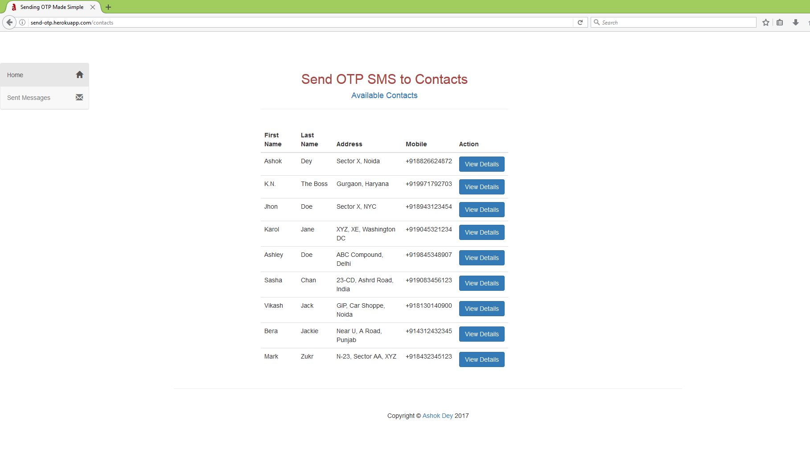
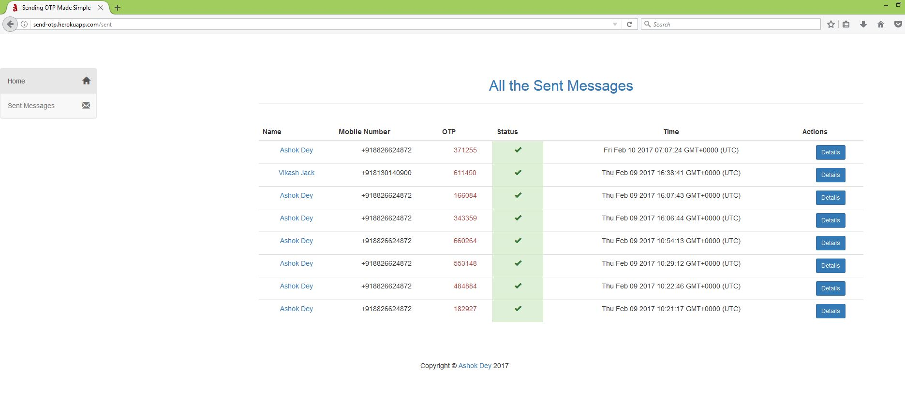
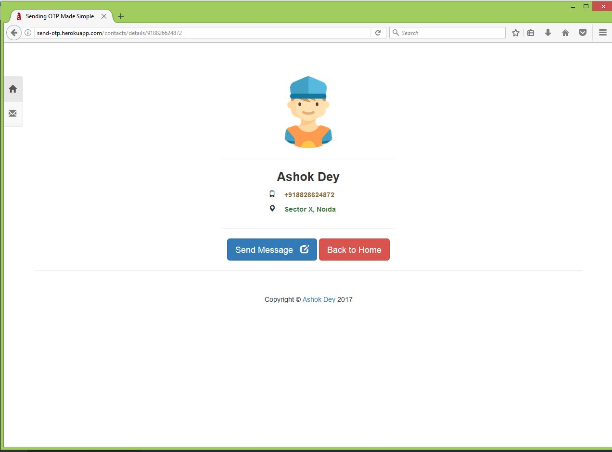
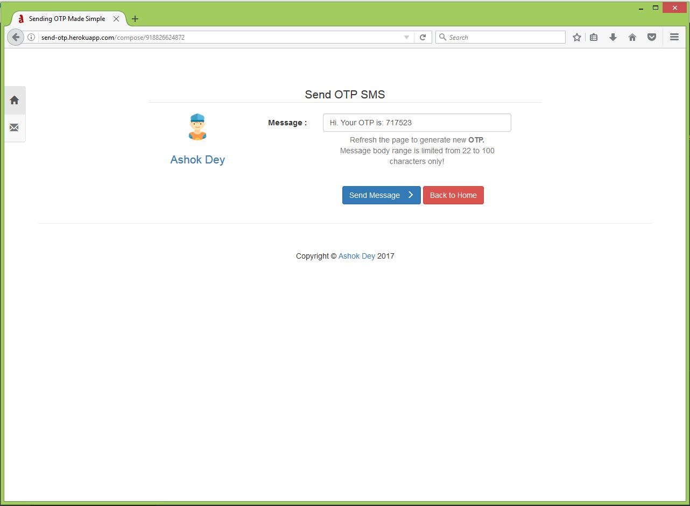
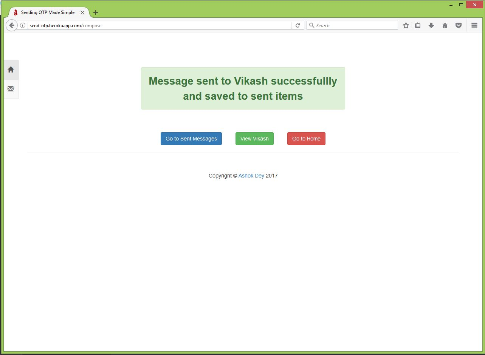
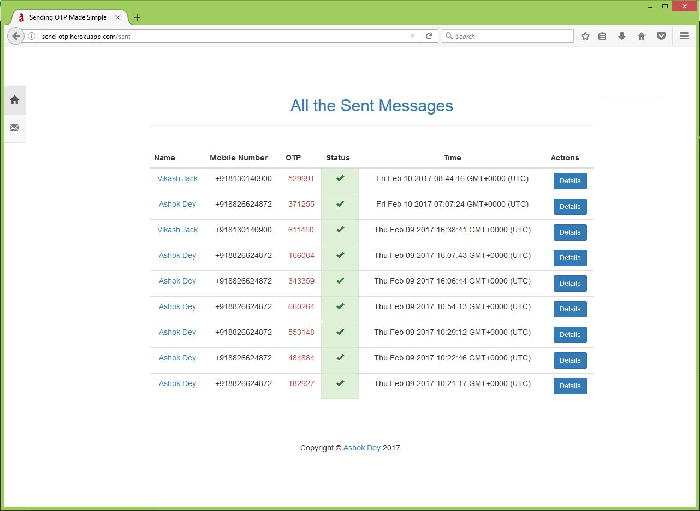
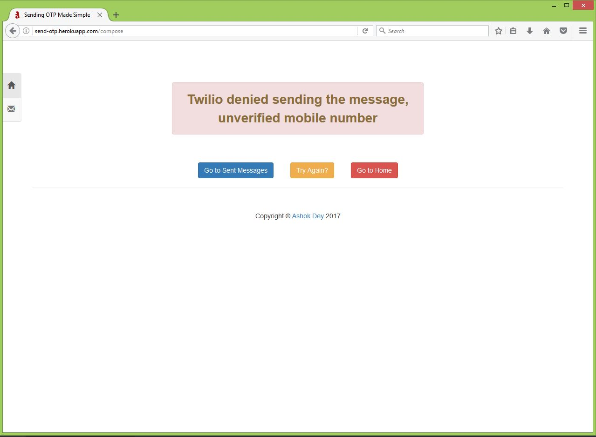
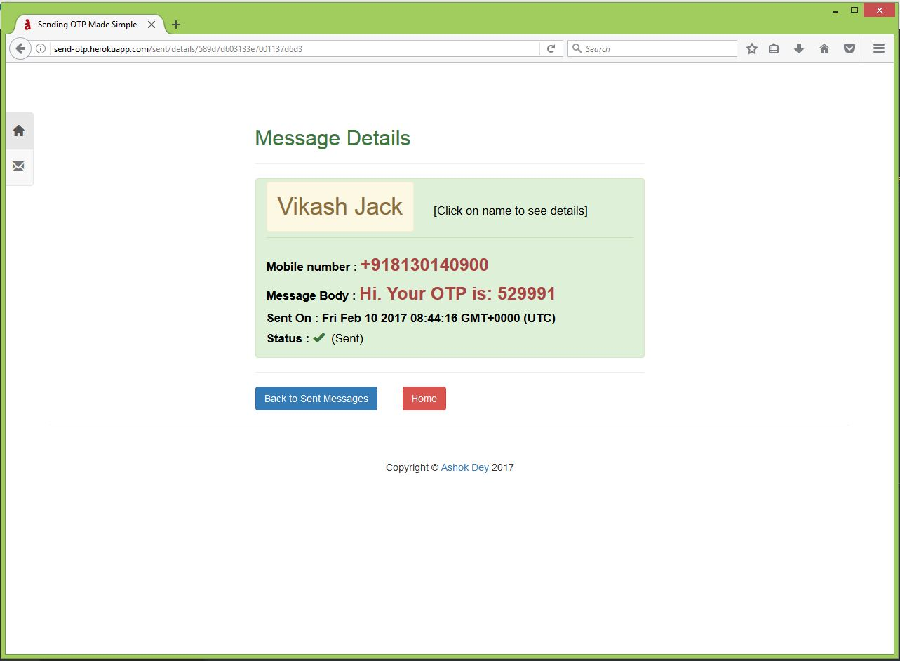
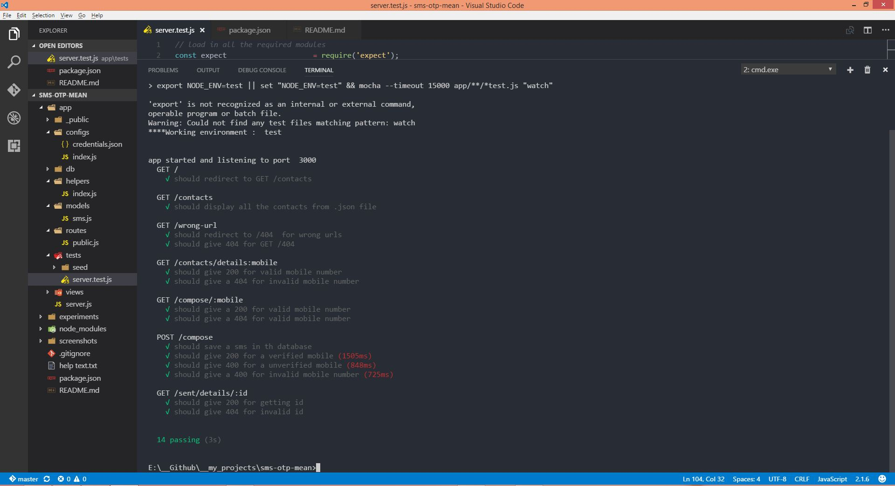

# Send OTP to your contacts
* This is a simple web application to send OTP to your saved contacts. 
* This has 2 menus 'Home' - The main page and 'Sent Messages' - Where you can view all the sent messages.

### How to Setup?
* Download and install _**NodeJS and MongoDB**_.
* _**Clone**_ this repository.
* In the terminal, type _**npm install & npm start**_ to setup and run the application.

### How to Test?
_Open terminal, type **npm run test-watch**, there are in total **14 test cases** which should pass._

### Libraries Usesd
* I have used the **_Twilio API_** to send the OTP messages.
  * The API credentials are saved in a JSON file inside _**app/configs/credentials.json**_ 

### Tools and Libraries Used 
* I used the following 
  * _Code Editior : **VS Code**_
* Librariies:
  * _**Express, body-parser, EJS, Ldash, Mongoose, Mongodb, Twilio, Validator**_
  * _**Mocha, Supertest and Expect**_ is used for testing.

### Screenshot
* _**Application UI**_
  * 
  * 
  * 
  * 
  * 
  * 
  * 
  * 

* _**Test Cases**_
  * 
 
### Credits 
* _Icons are taken from : **Flaticon** and are Made by **Freepik**, Licensed under **CC 3.0**_